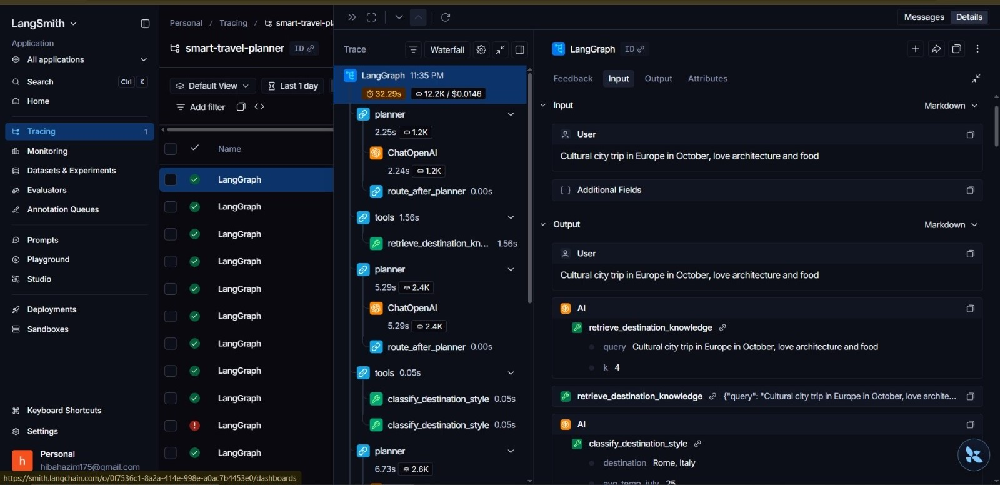

# Smart Travel Planner

An AI-powered travel planning system that matches users to destinations using:
- Retrieval-Augmented Generation (RAG with pgvector)
- Machine Learning classification (travel style prediction)
- Live external APIs (weather, currency, flights)
- LangGraph multi-step agent orchestration
- FastAPI async streaming (SSE)

---

# Architecture

User Query  
→ FastAPI (async + SSE streaming)  
→ LangGraph Agent  

Planner Node (gpt-4o-mini):
- RAG retrieval (pgvector)
- ML classifier (travel style prediction)
- Live API calls (weather, FX, flights)
- Tool routing logic

Synthesizer Node (gpt-4o):
- Final response generation

→ PostgreSQL (pgvector + logs + agent runs)  
→ Discord / Slack webhook (async delivery)

---

# Dataset Labeling Rules

destinations classified into 6 travel styles using weighted scoring.

Adventure:
- hiking_score (0.35)
- nature_score (0.25)
- crowd_index inverse (0.20)
- cost inverse (0.10)
- wellness_score (0.10)

Relaxation:
- beach_score (0.35)
- wellness_score (0.25)
- crowd_index inverse (0.20)
- temperature warmth (0.15)
- safety_score (0.05)

Culture:
- cultural_sites (0.30)
- food_scene (0.25)
- nightlife (0.20)
- english_score (0.15)
- infrastructure (0.10)

Budget:
- affordability (0.45)
- safety (0.25)
- english (0.20)
- infrastructure (0.10)

Luxury:
- cost level (0.35)
- luxury_hotels (0.30)
- safety (0.20)
- infrastructure (0.15)

Family:
- family_amenities (0.35)
- safety (0.30)
- english (0.15)
- infrastructure (0.10)
- wellness (0.10)

All features are normalized to [0,1] before scoring.

---

# Chunking & Retrieval Strategy

Chunk size: 512 tokens  
Reason: captures full semantic sections without splitting meaning

Overlap: 64 tokens  
Reason: preserves continuity between chunks

Top-k retrieval: 4  
Reason:
- 3 misses context
- 5 introduces duplicates
- 4 gives best balance

Index: IVFFlat (cosine similarity)  
Reason: efficient approximate search for small/medium corpus

Strategy:
- Section-aware splitting first
- Sliding window fallback for long sections

---

# ML Model Comparison

Run training:

uv run python ml/train.py

Results stored in:

ml/results.csv

Models compared:

- GradientBoostingClassifier
- RandomForestClassifier
- LogisticRegression (OvR)
- Tuned GradientBoosting

Metrics:
- Accuracy (mean ± std)
- F1-macro (mean ± std)

---

# Why GradientBoosting was chosen

- Handles non-linear feature interactions
- Strong performance on tabular data
- Works well on small datasets
- Easy hyperparameter tuning
- Stable generalization

---

# Per-Query Cost Breakdown

Example query:
"I have 2 weeks in July with $1500 for hiking in a warm destination"

Query rewrite (gpt-4o-mini):
- 150 input tokens / 20 output tokens
- Cost: ~0.000034$

Tool routing (gpt-4o-mini):
- 800 input / 200 output
- Cost: ~0.00024$

Final synthesis (gpt-4o):
- 2000 input / 600 output
- Cost: ~0.011$

Total per query:
~0.011 USD

---

# LangSmith Trace

---

# Project Structure

backend/
  agent/        LangGraph orchestration
  rag/          document ingestion + retrieval
  ml/           training pipeline
  api/          FastAPI routes (SSE streaming)
  services/     embeddings + webhook delivery
frontend/       React + Tailwind UI
docker-compose.yml

---

# Setup Instructions

Install dependencies:

uv sync

Start database:

docker compose up db -d

Run migrations:

alembic upgrade head

Train ML model:

uv run python ml/train.py

Ingest RAG data:

uv run python rag/ingest.py

Start full system:

docker compose up --build

# Notes

- Fully async system (FastAPI + LangGraph)
- Hybrid reasoning (RAG + ML + LLMs)
- Cost-controlled multi-model routing
- Production observability (LangSmith + DB logs)